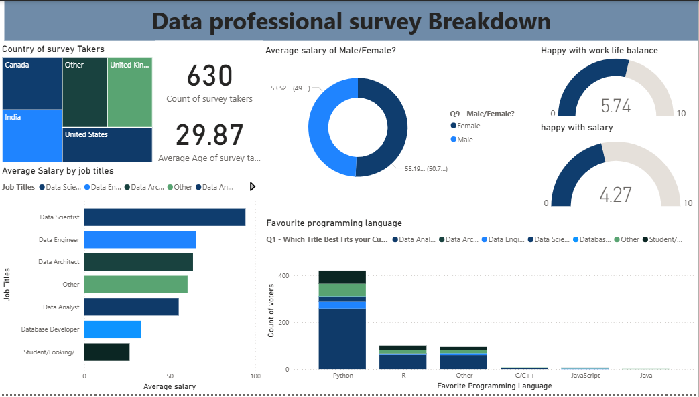

# 📊 Data Professional Survey Dashboard – Power BI

## 📌 Project Overview
This project presents an **interactive Power BI dashboard** built from a dataset of survey responses from data professionals across multiple countries.  
The dashboard provides insights into **demographics, salaries, job satisfaction, and skill preferences** in the data industry, enabling quick and intuitive exploration of trends.

---

## 🎯 Objectives
- Visualize the distribution of survey participants by country.
- Analyze average salaries by job title and gender.
- Assess satisfaction levels with work–life balance and salary.
- Identify the most popular programming languages among data professionals.
- Provide a clean, interactive interface for stakeholders to explore the survey results.

---

## 📂 Dataset
- **Source:** Data Professional Survey (uploaded dataset)
- **Rows:** 630 survey responses
- **Key Fields:**
  - Country of survey taker
  - Age
  - Job title
  - Gender
  - Salary
  - Work–life balance rating
  - Salary satisfaction rating
  - Favourite programming language

---

## 🛠️ Tools & Technologies
- **Power BI Desktop** – Data modeling, DAX calculations, and dashboard creation
- **Power Query** – Data cleaning and transformation
- **Excel/CSV** – Raw dataset storage and initial inspection

---

## 🔍 Data Preparation
1. **Data Cleaning in Power Query**
   - Removed duplicates and irrelevant columns.
   - Standardized categorical values (e.g., job titles, programming languages).
   - Handled missing values in salary and ratings.
2. **Data Modeling**
   - Ensured correct data types for numerical and categorical fields.
   - Created calculated columns and measures for KPIs (e.g., average salary, satisfaction scores).

---

## 📊 Dashboard Features
1. **Country of Survey Takers**  
   - Map visualization showing participant distribution across countries (Canada, India, UK, USA, etc.).

2. **Key Metrics Cards**  
   - Total survey count: **630**
   - Average age: **29.87 years**

3. **Average Salary by Job Title**  
   - Horizontal bar chart comparing salaries for:
     - Data Scientist
     - Data Engineer
     - Data Architect
     - Other
     - Student/Intern

4. **Average Salary by Gender**  
   - Donut chart comparing male vs. female average salaries.

5. **Satisfaction Ratings**  
   - Work–life balance: **5.74 / 10**
   - Salary satisfaction: **4.27 / 10**

6. **Favourite Programming Language**  
   - Bar chart showing popularity of Python, R, and other languages.

---

## 📈 Key Insights
- **Python** is the most popular programming language among respondents.
- **Data Scientists** report the highest average salaries in the dataset.
- Work–life balance satisfaction is notably higher than salary satisfaction.
- The majority of respondents are from **India, USA, Canada, and the UK**.

---

## 📦 Deliverables
- **Power BI Dashboard (.pbix)** – Fully interactive report.
- **Cleaned Dataset** – Processed survey data ready for analysis.
- **README Documentation** – Project overview, methodology, and insights.

---

## 🚀 How to Use
1. Download the `.pbix` file from this repository.
2. Open it in **Power BI Desktop**.
3. Interact with filters and visuals to explore the data.

---

## 📜 Résumé‑Ready Summary
> Designed and developed an interactive Power BI dashboard analyzing 630 survey responses from data professionals worldwide. Cleaned and modeled the dataset in Power Query, created DAX measures for KPIs, and visualized insights on demographics, salaries, satisfaction, and skill preferences. Delivered a user‑friendly dashboard enabling stakeholders to explore industry trends.

---

## 📷 Dashboard Preview
*(Add screenshots here)*  

